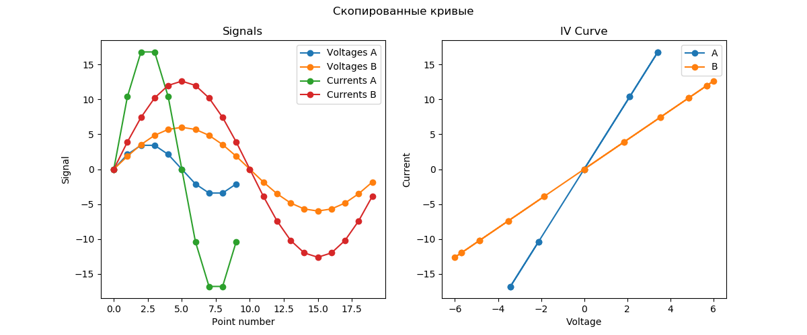
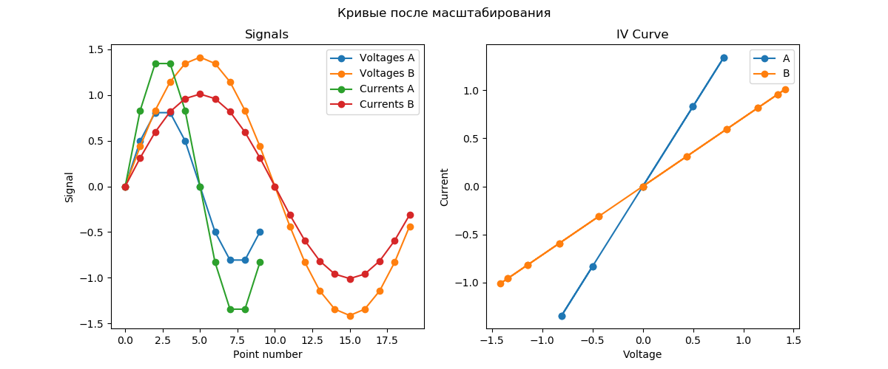
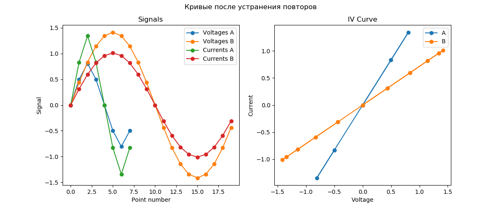

# Алгоритм сравнения сигнатур EyePoint

1. Входные кривые A и B копируются во внутреннее представление для последующей обработки.

   

2. Проверяется валидность данных. Если кривой А или кривой B нет – возвращается -1 (ошибка сравнения).

3. Кривые масштабируются на заданные диапазоны измерений по напряжению $range_V$ и току $range_I$: 

   $$V_A := \frac{V_A}{range_V}$$

   $$V_B:= \frac{V_B}{range_V}$$

   $$I_A := \frac{I_A}{range_I}$$

   $$I_B:= \frac{I_B}{range_I}$$

   

4. Из кривых исключаются повторяющиеся точки при наличии.

   

5. Вычисляются расстояния от кривой A до кривой B $dist(c_A, c_B)$ и от кривой B до кривой A $dist(c_B, c_A)$ ([см. Вычисление расстояния между кривыми](#вычисление-расстояния-между-кривыми)).
6. В качестве степени различия кривых A и B выбирается максимальное из двух значений:

   $$\text{Степень различия} = max(dist(c_A, c_B), dist(c_B, c_A))$$

### Вычисление расстояния между кривыми

Чтобы вычислить расстояние от кривой A до кривой B $dist(c_A, c_B)$, применяется следующий алгоритм:
1. Для каждой точки $p$ кривой A вычисляется евклидово расстояние $v[i]$ до всех точек $c[i]$ кривой B: 

   $$v[i] = \sqrt{(c[i]_x - p_x)^2  + (c[i]_y - p_y)^2}$$

2. Находится индекс $i_{min}$ ближайшей к точке $p$ точки $c[i]$ кривой B:
   
   $$i_{min} = argmin(v[i])$$.

3. Вычисляется расстояние от точки $p$ до отрезка, образованных точками кривой B: между точками с индексами $i_{min}$ и $i_{min} + 1$, а также $i_{min}$ и $i_{min} - 1$. Из двух вариантов выбирается наименьшее расстояние.
4. Процедура повторяется для всех точек кривой A. Максимальное из полученных локальных расстояний принимается за итоговое расстояние от кривой A до кривой B.
