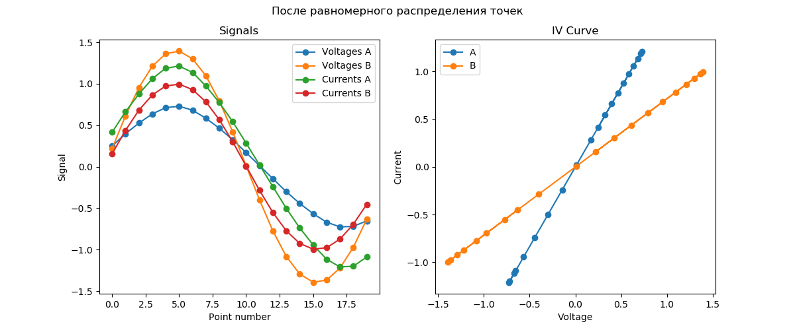

# Алгоритм сравнения сигнатур EyePoint

0. Поданные на вход кривые A и B копируются во внутреннее представление.

   

1. Если кривой канала А нет – возвращается -1 (ошибка сравнения).

2. Вычисляются максимальные разбросы тока и напряжения:

   $$var_x = \sqrt{\langle(x - \langle x \rangle)^2\rangle}$$

   $$\langle \cdot \rangle \quad \text{— усреднение}$$

   $$var_V = max(var_{V_A}, var_{V_B})$$

   $$var_I = max(var_{I_A}, var_{I_B})$$

3. Кривые масштабируются на максимальный разброс: 

   $$V_A := \frac{V_A}{var_V}$$

   $$V_B:= \frac{V_B}{var_V}$$

   $$I_A := \frac{I_A}{var_I}$$

   $$I_B:= \frac{I_B}{var_I}$$

   

4. Из кривых исключаются повторяющиеся точки при наличии.

   

5. Кривые интерполируются так, чтобы они содержали одинаковое количество точек и эти точки были расположены равномерно.

   

6. Если кривой B нет, вычисляется средний ток кривой A и возвращается степень различия по нему:

   $$\text{Степень различия} = 1 - e^{-8 \cdot \langle I_A \rangle^2}$$

7. Если обе кривые есть, вычисляется симметризованный квадрат расстояния между кривыми ([см. Вычисление симметризованного квадрата расстояния между кривыми](#вычисление-симметризованного-квадрата-расстояния-между-кривыми)).

8. Для вычисленного симметризованного квадрата расстояния производится нелинейное масштабирование коэффициента различия ([см. Нелинейное масштабирование коэффициента различия](#нелинейное-масштабирование-коэффициента-различия)).

### Вычисление симметризованного квадрата расстояния между кривыми

Симметризованный квадрат расстояния между кривыми A и B равен:

$$d_s = \frac{dist(c_A, c_B) + dist(c_B, c_A)}{2}$$

$dist(c_A, c_B)$ - квадрат расстояния от кривой A до кривой B, $dist(c_B, c_A)$ - квадрат расстояния от кривой B до кривой A.

### Вычисление квадрата расстояния между кривыми

Чтобы вычислить квадрат расстояния от кривой A до кривой B $dist(c_A, c_B)$, применяется следующий алгоритм. 

1. Для каждой точки $p$ кривой A вычисляется квадрат расстояния $v[i]$ до всех точек $c[i]$ кривой B: 

   $$v[i] = (c[i]_x - p_x)^2  + (c[i]_y - p_y)^2$$

2. Находится номер $i$ ближайшей к $p$ точки $c[i]$:
   
   $$i_{min} = argmin(v[i])$$.

3. Находится квадрат расстояния от точки $p$ до отрезка, образованного точками $i$ и $i + 1$ или $i$ и $i - 1$ кривой B (тот, который будет ближе).

4. Такие квадраты расстояния суммируются для всех точек $p$ и нормируются на их количество.

### Нелинейное масштабирование коэффициента различия

$$\text{Степень различия} = 1 - e^{-8d_s}$$

$d_s$ - симметризованный квадрат расстояния между кривыми.
