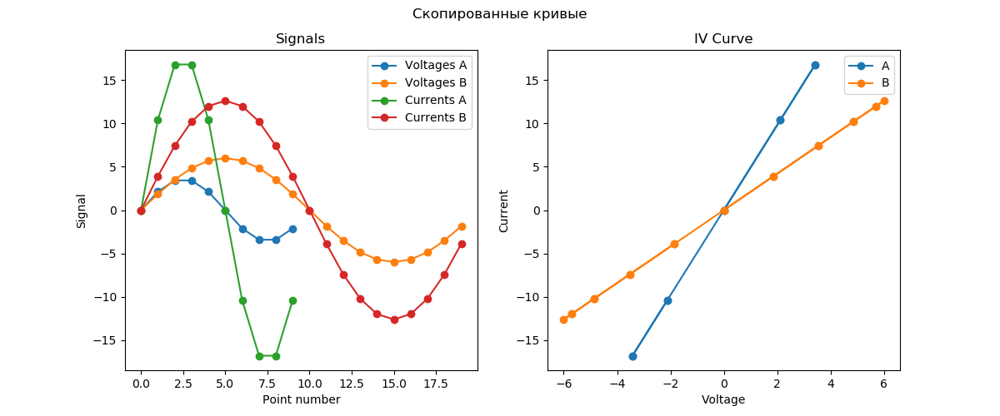
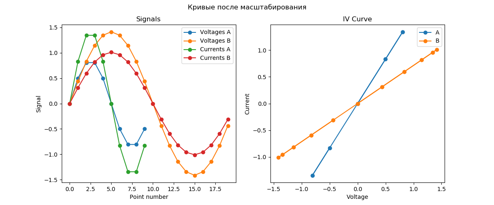
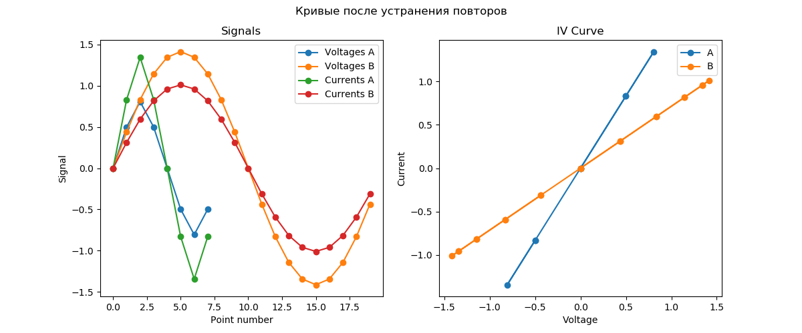
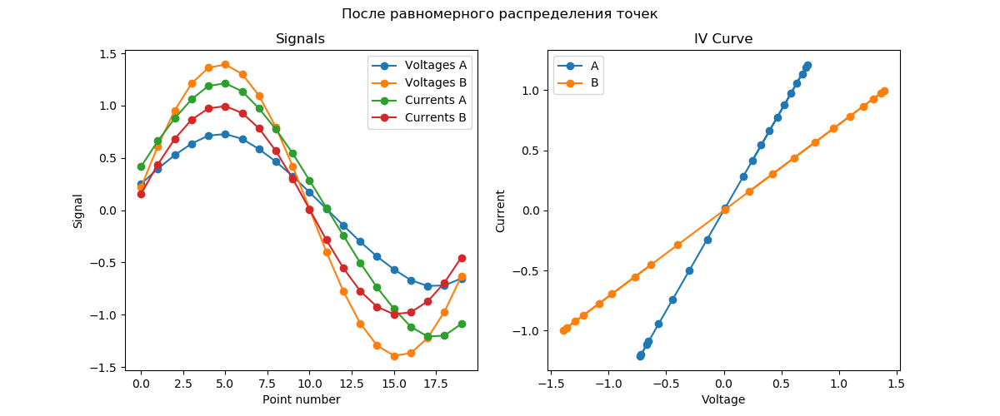

# Алгоритм сравнения сигнатур EyePoint

0. Поданные на вход кривые копируются во внутреннее представление.

   

1. Если кривой канала А нет – возвращаем 0 (полное несовпадение).

2. Вычисляются vмаксимальные разбросы тока и напряжения $var_x = \sqrt{<(x - <x>)^2>}$, $<.>$ - усреднение: 

   $var_v = max\{var_{v_a}, var_{v_b}\}$

   $var_I = max\{var_{I_a}, var_{I_b}\}$

3. Кривые выравниваются относительно среднего и масштабируются на максимальный разброс: 
  $v_a := \frac{(v_a - <v_a>)}{var_v}$

  $v_b:= \frac{(v_b - <v_b>)}{var_v}$

  $I_a := \frac{(I_a - <I_a>)}{var_I}$

  $I_b:= \frac{(I_b - <I_b>)}{var_I}$

  

4. Из кривых исключаются повторяющиеся точки при наличии. 

   

5. Кривые интерполируются так, чтобы они содержали одинаковое количество точек и эти точки были расположены равномерно.

   

6. Если кривой b нет, вычисляем средний разброс по току  от кривой a и возвращаем степень различия по нему. Если разброс по току (разрыв) - кривые совпадают. Если разброс по току большой (КЗ) - кривые различаются. 

7. Если обе кривые есть, вычисляется расстояние  между кривыми.

8. Для найденного расстояния производится нелинейное масштабирование коэффициента различия.

### Вычисление расстояния между кривыми

1. Для каждой точки $p$ одной кривой вычисляется расстояние $v[i]$ до всех точек $c[i]$ другой кривой: 

   $v[i] = (c[i]_x - p_x)^2  + (c[i]_y - p_y)^2 $

2. Находится номер номер $i$ ближайшей к $p$ точки $c[i]$:

   $i_{min} = argmin(v[i])$.

3. Находится расстояние от точки $p$ до отрезка, образованного точками $i$ и $i + 1$ или $i$ и $i - 1$ (тот, который будет ближе).

4. Такие расстояния суммируются для всех точек $p$ и нормируются на их количество. 

### Нелинейное масштабирование коэффициента различия

$Степень\;различия = 1 - e^{-8d_s}$

$d_s$ - симметризованное расстояние между кривыми: $d_s = \frac{dist(c_a, c_b) + dist(c_b, c_a)}{2}$ 
